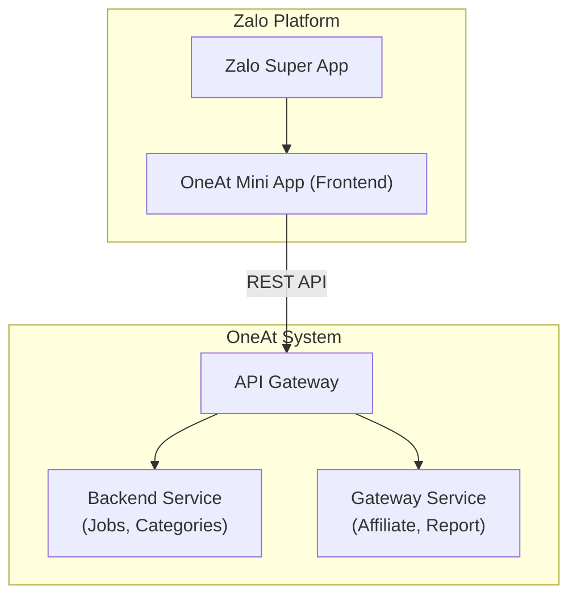

# 🚀 Zalo Mini App — Affiliate Platform POC

---

## Slide 1: OneAt Affiliate trên Zalo Mini App (POC)
- **Dự án**: Nền tảng Affiliate OneAt tích hợp Zalo
- **Mục tiêu phiên bản POC**: Đánh giá tính khả thi khi đưa nền tảng affiliate lên môi trường Zalo Mini App.
- **Trạng thái**: ✅ Hoàn thành POC

---

## Slide 2: Tại sao chọn Zalo Mini App?
Đưa hệ thống affiliate tiếp cận tệp người dùng khổng lồ với rào cản thấp nhất.

- **Tiếp cận 155M+ người dùng Zalo**: Sẵn sàng khai thác tập user bản địa lớn.
- **Zero Friction**: Người dùng mở trực tiếp trong Zalo, không cần qua App Store / Google Play.
- **Chuyển đổi cao**: Tận dụng khả năng chia sẻ (Share) link affiliate cực nhanh qua chat Zalo.
- **Tích hợp sẵn hệ sinh thái**: Dễ dàng sử dụng Zalo Auth (Đăng nhập) và Zalo Pay.

---

## Slide 3: Mục tiêu của phiên bản POC
Chứng minh Zalo Mini App có thể đáp ứng Core Flow của một nền tảng Affiliate.

1. **Hiển thị & Tìm kiếm**: Render được danh sách chiến dịch, chi tiết việc làm mượt mà.
2. **Khai thác API thực**: Kết nối thành công với Backend API hiện tại (`apigw-publisher.dev.oneat.org`).
3. **Tạo Tracking Link**: Thực hiện được tác vụ quan trọng nhất là lấy affiliate link.
4. **Hiển thị Báo cáo**: Xử lý và hiển thị biểu đồ, số liệu thống kê doanh thu cá nhân.

---

## Slide 4: Kiến trúc Hệ thống Tổng thể
Zalo Mini App đóng vai trò là một Frontend client hoạt động trơn tru với hệ thống API hiện tại.

---

## Slide 5: Lựa chọn Công nghệ (Tech Stack)
Sử dụng công nghệ web hiện đại, tối ưu cho Zalo.

- **Core**: ReactJS 18 + TypeScript (Đảm bảo hiệu năng và dễ maintain).
- **UI Components**: **ZMP UI** (Bộ UI chuẩn của Zalo, giúp app nhìn giống "Native Zalo").
- **State Management**: Jotai (Quản lý trạng thái gọn nhẹ, thay thế Redux).
- **Network**: Axios (Gọi API, có xử lý auth token).
- **Build Tool**: Vite (Build tốc độ cao, tối ưu dung lượng mini app).

---

## Slide 6: Trải nghiệm Nền tảng (Core Flow)
Flow cơ bản đã được hiện thực hóa trong POC:

1. **Khám phá**: User vào app ➔ Xem danh sách việc làm ➔ Lọc theo danh mục.
2. **Nhận Việc**: Xem chi tiết chiến dịch ➔ Đọc rõ chính sách hoa hồng.
3. **Tạo Link**: User nhập link sản phẩm ➔ Hệ thống tạo Tracking Link riêng.
4. **Theo dõi**: User vào màn hình Báo cáo ➔ Xem lượt Click, số Đơn hàng & Hoa hồng tạm tính.

---

## Slide 7: Chứng minh Tích hợp Dữ liệu
POC không dùng data giả, mà đã kết nối luồng dữ liệu thật thành công.

- **Danh mục & Job List**: Pull data từ Backend thông qua `GET /backend-service...`
- **Tạo Tracking Link**: Giao tiếp với Affiliate Service `POST /gateway-service...`
- **Real-time Report**: Lấy thống kê Click, Chuyển đổi, Thu nhập thành công.
- **Xử lý Token**: Auth token được truyền đúng chuẩn qua header để truy xuất data cá nhân.

---

## Slide 8: Đánh giá Tính Khả Thi (Kết luận POC)
**Kết luận: HOÀN TOÀN KHẢ THI** để build OneAt Affiliate trên Zalo.

| Tiêu chí | Đánh giá khả năng của Zalo Mini App |
|---|---|
| **Giao diện (UI/UX)** | ✅ Tốt. Component Zalo cho cảm giác mượt mà như native app. |
| **Logic Phức Tạp**   | ✅ Đáp ứng tốt. React xử lý mượt các data biến động liên tục (Báo cáo). |
| **Bảo mật / Auth**   | ✅ Khả thi. Hỗ trợ cơ chế token JWT tương tự web. |
| **Hiệu năng & Build**| ✅ Nhanh. File build nhẹ, load tức thì trong app Zalo. |

---

## Slide 9: Tiềm năng mở rộng
Những lợi thế "độc quyền" khi dùng Zalo Mini App so với Web/App thường:

- **1-Click Login**: Thay vì bắt user đăng ký lằng nhằng, lấy luôn số điện thoại / profile Zalo.
- **Zalo Broadcast / ZNS**: Gửi thông báo "Có chiến dịch hoa hồng cao mới" thẳng vào tin nhắn Zalo của Pub.
- **Share to Chat**: Nút "Chia sẻ cho bạn bè" gửi banner cực đẹp thẳng vào group chat.
- **Zalo Pay Verification**: Trả hoa hồng cực nhanh và chuẩn xác.

---

## Slide 10: Next Steps (Giai đoạn tiếp theo)

1. **Hoàn thiện Zalo Login**: Tích hợp luồng xác thực thực tế với Zalo SDK (Lấy SĐT).
2. **Deep-linking**: Cho phép người dùng click link trên Zalo, mở thẳng vào màn hình chi tiết chiến dịch trong Mini App.
3. **Hoàn thiện UI/UX**: Chăm chút lại animation, dark mode và các edge cases (lỗi mạng, hết hạn token).
4. **Tích hợp Zalo Share**: Triển khai API chia sẻ native để tăng độ viral.
